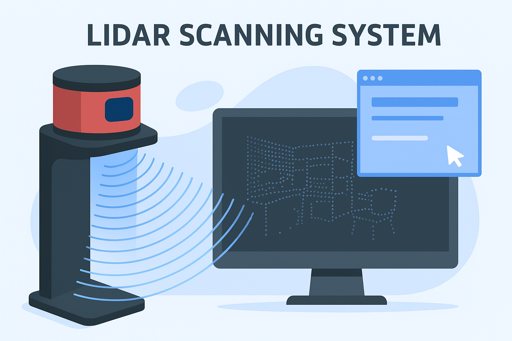

# About me
Resourceful and self-driven developer with over a decade of programming experience in
Python, C++, PHP, and HTML/CSS, along with six years of hands-on work in electronics
and embedded systems. Recently graduated with an AP degree in IT Technology and
have experience working both independently and collaboratively on a wide range of
projects. Skilled across domains including robotics, embedded systems, machine
learning, web development, and 3D modeling using Blender and Fusion 360. Known for
strong problem-solving instincts and an ability to identify subtle issues or
unconventional solutions where others may get stuck.

---

# Education
***IT-teknolog AK - UCL Erhvervsakademi og Professionshøjskole, Odense***

2023 - 2025

***Learning outcomes:*** 
***Embedded Systems & Hardware Design*** 
* Designed and built systems using microcontrollers and analog/digital electronics
* Developed reliable, testable embedded systems for data collection and device control
* Gained practical experience with IoT device design and communication protocols\
  
***Software Development & Scripting*** 
* Developed software in C for embedded and IoT systems
* Used Python for automation, scripting, and network configuration tasks
* Implemented data pipelines and cloud-based processing systems\
  
***Project Management*** 
* Led and contributed to technical projects from concept to delivery
* Applied project management tools for resource planning, risk assessment, and budgeting
* Gained hands-on experience managing people and timelines in real-world scenarios\
  
***Internet of Things (IoT) Systems*** 
* Built end-to-end IoT systems: from sensor data collection to cloud-based data processing
* Focused on IT security across the entire IoT ecosystem
* Progressed from basic component work to advanced systems integration in projects

---

# Professional experience 
***Webmaster - DanskeServiceYdelser***

2019 - 2022

***Tasks***
Development of website and platform. Daily operation of the website. Ongoing
maintenance and updating of the website.

***What did I become particularly good at***

Development of a platform that works on all devices such as PC, tablet and phones.
Front- and backend website development divided into levels

---
# Projects

## Hand Tracking and Gesture Recognition

This project involved the design and implementation of a real-time hand tracking and gesture recognition system for natural interaction within a defined workspace. The system recognizes four gestures: Point, Pinch, Open Hand, and Swipe, making it suitable for applications in Augmented Reality (AR) where controller-free interaction is key.

### Project Highlights

***System Design***
* Implemented a top-down camera setup capturing hand movements within a calibrated interaction frame.
  
* Built a pipeline combining Computer Vision (CV) and Machine Learning (ML) approaches for gesture recognition.

***Computer Vision Techniques***
* Applied preprocessing methods (grayscale conversion, histogram equalization, Gaussian blur, bilateral filtering) to improve robustness.

* Used Canny edge detection, contour detection, convex hull, and convexity defect analysis to isolate and analyze hand shape.

* Developed rules based on convex hull angles and line segment lengths to classify gestures (e.g., distinguishing between Open Hand and Pinch).

* Implemented gesture dynamics detection: Swipe was recognized through frame-to-frame displacement of the convex hull.

***Machine Learning Approach***
* Built and trained a Convolutional Neural Network (CNN) in TensorFlow using a custom dataset of labeled gesture images.

* Model architecture included multiple Conv2D and pooling layers, with a final dense layer for classification into Open Hand, Pinch, and Point.

* Tested different activation functions, with sigmoid performing best for multi-class gesture classification.

### Results

***Computer Vision:*** Delivered robust gesture recognition and hand tracking, though performance was sensitive to lighting conditions.

***Machine Learning:*** Successfully classified gestures from static images but lacked temporal awareness (e.g., could not detect Swipe).

***Comparative evaluation*** showed that CV was more reliable for AR integration, while ML offered strong potential when combined with better datasets.

## LiDAR Scanning System

**Overview**  
Developed a complete LiDAR-based 3D scanning system (hardware + software) capable of generating accurate point clouds of real-world environments for virtual inspection and measurement. The project built upon an initial prototype (LiDAR v1) and delivered an optimized second version (LiDAR v2) with faster scanning, higher accuracy, and added functionality for analysis.  

**Key Contributions**  
- **Hardware Development**  
  - Designed and built a custom LiDAR scanner using ESP32 microcontroller and Arduino.  
  - Upgraded from a single-point TF-Luna sensor (LiDAR v1) to a 360° LiDAR sensor (LiDAR v2), reducing scan time from **87 minutes → ~11 minutes**.  
  - Designed the scanner enclosure in Fusion 360 and 3D printed custom parts.  
  - Implemented battery power system with dual 18650 Li-ion cells for higher torque servo support.  
  - Corrected mechanical tilt errors via software calibration (+2.6° compensation).  

- **Software Development**  
  - Built a desktop application in **C++ with Qt and OpenGL** for real-time point cloud visualization.  
  - Implemented **point cloud import/export** and optimized memory usage (reduced peak RAM from **775 MB → 281 MB**).  
  - Achieved dataset loading time improvements (**115 sec → 5 sec for ~188k points**).  
  - Developed interactive **measurement tool** (raycasting + 3D vector math) to measure distances with ~6.5 cm error (within sensor tolerance).  
  - Implemented **point cloud slicing tool** using OpenGL shaders for isolating regions of interest.  
  - Structured application into modular C++ classes for maintainability (e.g., mainView, treeView, tool classes).  

- **Testing & Results**  
  - Validated measurement accuracy with real-world comparison (laser vs LiDAR).  
  - Verified reconstruction precision: LiDAR v2 point clouds clearly identify walls, desks, and objects.  
  - All project requirements (accuracy, performance, usability) were met or exceeded.  

**Technologies Used**  
- Hardware: ESP32, Arduino, TF-Luna LiDAR, 360° LiDAR sensor, 18650 Li-ion battery system, Fusion 360, 3D printing  
- Software: C++, Qt, OpenGL, GLSL shaders, Python (data preprocessing)  
- Skills: Embedded programming, 3D graphics programming, real-time point cloud rendering, hardware/software integration, optimization  

**Outcome**  
Delivered a fully functional LiDAR scanning system capable of creating accurate 3D models of environments, supporting measurements and analysis for scenarios where manual inspection is not feasible (e.g., sterile or inaccessible environments).  

