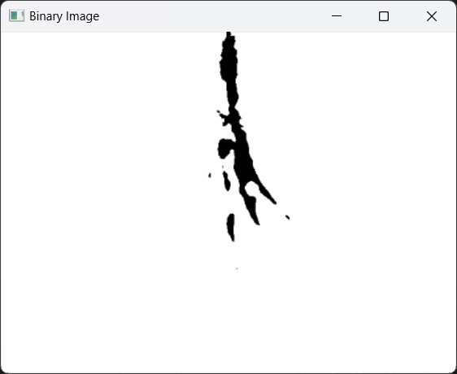

# <center>Håndsporing og Gesture genkendelse</center>


<div style="page-break-after: always;"></div>


## Indholdsfortegnelse
1. [Introduktion](#Introduktion)
2. [Problemstilling](#Problemstilling)
3. [Systemoversigt](#Systemoversigt)
4. [Teori](#Teori)
5. [ Implementering, Forsøg og test](#Implementering)
6. [Resultater](#Resultater)
7. [Vurdering](#Vurdering)
8. [Fremtidigt arbejde og forbedringer](#Fremtidigt_arbejde_og_forbedringer)


<div style="page-break-after: always;"></div>


## Introduktion <a name="Introduktion"></a>
<hr>

Denne portefølje fokuserer på udviklingen af et realtidshåndsporings- og gesture genkendelses system, designet til at muliggøre interaktion med en computer inden for et defineret interaktions område. Systemet genkender fire primære bevægelser: Point, Pinch, Open Hand og Swipe.

Porteføljen indholder herudover undersøgelser af effektiviteten af Computer Vision og Machine Learning til at opnå nøjagtig gesture genkendelse. Porteføljen er derfor opdelt i henholdsvis Computer Vision og Machine Learning underafsnitter. 


## Problemstilling <a name="Problemstilling"></a>
<hr>

Gesture detection og håndsporing kan bruges til specifikt AR, hvor kombinationen af ​​den virkelige verden og den digitale verden er nøglemålet. Ved at have en robust metode til at spore hænder giver det mulighed for en naturlig fysisk interaktion med den digitale verden, da man ikke er begrænset af en controller. Dette vil få AR-miljøet til at føles mere ægte end argumenteret. 
Der undersøges i porteføljen hvorvidt Computer Vision teknikker muliggøre effektiv Gesture detection og håndsporing med det formål at forbedre realismen i AR-miljøer.

<div style="page-break-after: always;"></div>


## Systemoversigt <a name="Systemoversigt"></a>
<hr>


### Kameraopsætning <a name="Kameraopsætning"></a>
Et fast top-down kamera fanger håndbevægelser i et forud defineret interaktions område.

### Interaktions område <a name="Interaktionsområde"></a>
En fysisk ramme, en måtte, bruges til gestus lokalisering og kalibrering, hvilket giver en konsistent reference til håndsporing og interaktion.

### Håndbevægelsesgenkendelse <a name="Håndbevægelsesgenkendelse"></a>

* Computer Vision: billedbehandlingsmetoder, såsom konturgenkendelse og kantdetektion, bruges til at detektere og spore gestures og bevægelser.

* Machine Learning: En Machine Learning Model bruges til at klassificere gestures ved at lære mønstre fra data.


## Teori <a name="Teori"></a>
<hr>


Det følgende afsnit indeholder de grundlæggende begreber og teknikker, der anvendes i udviklingen af ​​systemet i systemerne Computer vision og Machine Learning.
### Computer Vision <a name="Computer_Vision1"></a>
Computer Vision systemet er bygget op på en række Computer Vision teknikker. I løbet af valgfaget blev nogle teknikker afprøvet men kasseret derefter, da de ikke gav et tilfredsstillende resultat.
#### Grayscale Conversion 
Grayscale af et billede i OpenCV konverterer det til gråtoner, hvilket betyder en enkelt intensitets kanal, hvilket reducerer computer belastningen. Grayscale er nyttig til opgaver som Edge Detection.
```python
gray_frame = cv2.cvtColor(frame, cv2.COLOR_BGR2GRAY)
```
#### Histogram Equalization 
Histogram Equalization forbedrer billedkontrasten og gør detaljer i lyse eller mørke områder mere synlige. I et gråtonebillede er intensiteten som standard i området fra 0 til 255, men de bruger ikke nødvendigvis hele området. For eksempel, hvis et billede er meget mørkt, kan intensitetsværdierne være mellem 0 og 150, hvor de højere værdier ikke er til stede.
På samme måde kan et lyst billede indeholde kun værdier mellem 150 og 255.
Histogramudligning sikrer, at værdierne om fordeles over hele området fra 0 til 255, hvilket kan gøre små detaljer mere synlige.
```python
gray_frame = cv2.equalizeHist(gray_frame[:,:])
```
#### Gaussian Blur 
Gaussian Blur udglatter billedet for at reducere støj. 
```python
blurred_image = cv2.GaussianBlur(gray_frame, (7, 7), 1)
```
#### Bilateral Filter 
Bilateral Filter reducerer støj og bevarer kanter.
```python
bilateral_filtered = cv2.bilateralFilter(blurred_image, d=9, sigmaColor=75, sigmaSpace=75)
```
#### Canny Edge Detection 
Canny Edge Detection registrerer kanter i billedet ved at analysere farve skift. For eksempel bliver kanterne på hånden fundet da farve skiftet mellem den sorte måtte og hånden er tydelig.
```python
edges = cv2.Canny(bilateral_filtered, 20, 80)
```
#### Thresholding 
Thresholding konverterer billedet til et binært format ved en specifik værdi. her blev 120 valgt. Thresholding konvertere alle pixels under dene værdi til 0 hvilket svarer til sort, mens alle værdier over bliver sat til 255 hvilket svarer til hvidt. Dette vil for eksempel ydereligere isolere hånden fra den sorte måtte. derudover giver dette også mulighed for at se potentielt noise i billedet.
```python
_, binary = cv2.threshold(bilateral_filtered, 120, 255, cv2.THRESH_BINARY_INV)
```
#### Bitwise Operations 
Bitwise Operations inverterer billedet for yderligere skelne objekter fra hinanden. Bitwise Operations bliver brugt til at invertere resultatet fra thresholding.
```python
bilateral_filtered = cv2.bitwise_not(bilateral_filtered)
```

#### Find Contours 
Contours identificerer grænserne for objekter i det binære billede. 
```python
contours, hierarchy = cv2.findContours(binary, cv2.RETR_TREE, cv2.CHAIN_APPROX_NONE)
```
#### Convex Hull 
Convex Hull er den mindste convex figur som fuldt ud kan afgrænse en contour.
``` python
hull = cv2.convexHull(cnt, returnPoints=False)
```
#### Convexity Defects 
Convexity Defects er punkter der afviger indad fra Convex Hull figuren.
``` python
defects = cv2.convexityDefects(cnt, hull)
```
#### SIFT (Scale-Invariant Feature Transform) 
SIFT bruges til at finde key points i et billede baseret på et template. 
```python
# Initiate SIFT detector

sift = cv2.SIFT_create()

# Find the keypoints and descriptors with SIFT

kp1, des1 = sift.detectAndCompute(sift_image, None)

kp2, des2 = sift.detectAndCompute(binary, None)
```
#### Feature matchning med FLANN 
Matcher SIFT-deskriptorer ved hjælp af FLANN.
``` python
FLANN_INDEX_KDTREE = 1

index_params = dict(algorithm=FLANN_INDEX_KDTREE, trees=2)

search_params = dict(checks=50)   # or pass empty dictionary

  

flann = cv2.FlannBasedMatcher(index_params,search_params)

  

matches = flann.knnMatch(des1, des2, k=2)
```
#### DBSCAN Clustering 
DBSCAN Clustering grupperer matchede nøglepunkter i clusters baseret på distancen mellem punkter.  

```python
FLANN_INDEX_KDTREE = 1

index_params = dict(algorithm=FLANN_INDEX_KDTREE, trees=2)

search_params = dict(checks=50)   # or pass empty dictionary

  

flann = cv2.FlannBasedMatcher(index_params,search_params)

  

matches = flann.knnMatch(des1, des2, k=2)
```


### Machine Learning <a name="Machine_Learning1"></a>

#### TensorFlow Framework:
Tensorflow er det primære deep learning-bibliotek, der bruges til at opbygge og træne Machine Learning modellen.
#### CNN arkitektur
Convolutional Neural Network (CNN) inkluderer:
* tre Conv2D lag med ReLU-aktivering.
* tre max-pooling lag.
* Et Dense lag med 128 enheder og ReLU-aktivering.
* Et outputlag med sigmoid-aktivering.

```
Model: "sequential"
_________________________________________________________________
 Layer (type)                Output Shape              Param #
=================================================================
 conv2d (Conv2D)             (None, 62, 62, 32)        896

 max_pooling2d (MaxPooling2D  (None, 31, 31, 32)       0
 )

 conv2d_1 (Conv2D)           (None, 29, 29, 64)        18496

 max_pooling2d_1 (MaxPooling  (None, 14, 14, 64)       0
 2D)

 conv2d_2 (Conv2D)           (None, 12, 12, 128)       73856

 max_pooling2d_2 (MaxPooling  (None, 6, 6, 128)        0
 2D)

 flatten (Flatten)           (None, 4608)              0

 dense (Dense)               (None, 128)               589952

 dense_1 (Dense)             (None, 3)                 387

=================================================================
```

## Implementering, Forsøg og test <a name="Implementering"></a>
<hr>

Som nævnt i teori afsnittet er der udført nogle tests i Computer Vision systemet som gav nogle utilfredsstillende resultater. I dette afsnit illustreres disse. Det endelig system for både Computer Vision of Machine Learning vil også blive illustreret 
### Computer Vision <a name="Computer_Vision2"></a>

Den oprindelige tankegang bag Computer vision systemet var at ved hjælp af contours og convex hull defects kunne fingrene isoleres. Systemet ville følge dene struktur:
* Billedet Loades
* Billedet laves om til gråskala
* Kanter isolere hånden fra baggrunden 
* overlay bruges så baggrunden fjernes helt så det kun er hånden tilbage
* Billedet bliver lavet om til et binært billede for yderligere at isolere hånden 
* Contour detection of Convex hull defects findes og tegnes 
* De tegnede punkter får en titel afhængigt af hvilken finger de svarer til 

Denne tankegang virkede kun med et billede som er vist forneden 

      

Her illustreres den samme process på et andet billede hvor fingerne ikke er identificeret korrekt 

  
  

Den oprindelige tankegang bag systemet virkede helt op til det sidste punkt hvor fingerene skulle identificeres. Problemet med at identificere hver finger var at convex hull defects ikke altid fandt alle fingerne, eller at en finger fik flere punkter hvilket resulterede i forkert identifikation af fingerne. for at løse dette problem blev SIFT afprøvet. Tankegangen bag dette var at ved at have en SIFT template af kun fingerspidserne ville det være muligt at kombinere SIFT Key points med punkterne for Convex Hull defects, hvilket ville resultere i at det kun var fingerne der blev tildelt et defects punkt.


På sift billedet for oven ses det at det ikke kun er fingerspidserne der bliver identificeret som key points, dette kunne være skyld at de to billeder der bliver matchet begge kun indholder sort eller hvidt. På trods af dette kan det ses at hver finger har fået sin egen key point, men dette resulterede ofte alligevel i forkert identification af fingerne. Da både SIFT key points of convex hull defects har flere matches kunne SIFT ikke bruges til at identificere fingerne i dette system. 

Computer Vision systemet havde også et problem med billede belysning. hvis billedet ikke havde god nok belysning ville systemet fejle med at identificere fingerne. Ved at kigge på billederne forneden er hånden tydelig i det oprindelige billede, selv efter nogle Computer vision ændringer er hånden stadig tydelig. Overlay billedet bliver mere sløret i forhold til eksemplet for oven hvor overlay billedet viser en tydelig hånd. Da tresholdet brugt til at generere det binære billede er sat for højt er det kun en meget lille del af hånden der forbliver i billedet, resten er fjernet. Da contours findes på det binære billede er det kun den lille del af hånden der bliver tegnet op hvilket resultere i en convex hull illustreret for neden. Det kan ses at systemet kun har fundet et punkt, her ses den tilfældige fordeling af punkter også da punktet bliver tildelt et tilsynladende vilkårlig finger, i dette tilfælde index.

  
  


Da det er svært at tage højde for billede belysning er der fokuseret på at løse problemet med de vilkårlig defects. Problemet løses ved at undgå at analysere defects punkterne, men ved at analysere vinklerne i convex hull figuren samt lægen af linje stykkerne mellem vinkler. Dette gav et meget stabilt resultat da det er selve convex hull der tages højde for i modsætning til defects. convex hull illustreres forneden


Her kan det ses at convex hull har en vis mængde linje stykker, ud fra dette tegnes hvert linje stykke op i en unik farve som er defineret i koden 

```python
# Define a set of 30 colors for the convex hull line segments
line_colors = [
    (255, 0, 0), (0, 255, 0), (0, 0, 255), (255, 255, 0), (0, 255, 255), (255, 0, 255),
    (128, 0, 0), (0, 128, 0), (0, 0, 128), (128, 128, 0), (0, 128, 128), (128, 0, 128),
    (255, 165, 0), (255, 69, 0), (255, 105, 180), (255, 20, 147), (75, 0, 130), (138, 43, 226),
    (255, 140, 0), (153, 50, 204), (250, 128, 114), (255, 215, 0), (240, 128, 128), (255, 192, 203),
    (144, 238, 144), (32, 178, 170), (106, 90, 205), (102, 205, 170), (135, 206, 250)
]
```
Årsagen bag de unikt farvede segmenter er at give mulighed for visuelt at skelne individuelle segmenter inden for convex hull. Ved at bruge forskellige farver kunne hvert linjesegment let identificeres. Når hvert linjesegment er farvet, bliver det let at udpege specifikt, hvilket linjesegment der svarede til linjen mellem pegefingeren og tommelfingeren. Her er den farvet rød, hvilket svarer til det tredje linjesegment. Denne linje bruges til at bestemme, om håndbevægelsen er Open Hand eller Pinch, ved at måle længden af ​​linjen.
```python
elif 5 <= len(angles) <= 10:

            gesture = "Open Hand"

        if 'length' in locals() and 50 <= length <= 100:

            gesture = "Pinch"
```

Point gesture er også bygget op med samme princip dog med en anderledes tilgang. det unikke ved Point gesture er at Convex hull figuren har et mindre antal vinkler end den har i de to andre gestus. Baseret på dette analyseres Convex hull figuren for at finde den vinkel med en specifik vinkel, denne vinkel svare til pege fingeren.
```python
if any(angle > 150 for angle in angles):

            gesture = "Point"
```

### Machine Learning <a name="Machine_Learning2"></a>

Machine Learning modellen er trænet på et custom dataset. Datasættet indholder jpg farve billeder i størrelsen 640x480 og delt op i specifikke mapper struktureret som følgende
* ML_dataset
  * OpenHand
  * Pinch
  * Point

Hver gesture indholder et sæt billeder som nævnt foroven. Python programmet dataset_maker.py er brugt til at tage billederne. Billederne bliver taget ud fra en video hvor håndens position, vinkel og rotation ændres. Dette er gjort individuelt for hver gesture. 

Tankegangen bag dette var at hvis datasættet kun indholder en bestem position, vinkel og rotation af hånden ville modellen kun kunne genkende en gesture hvis den opfyldte precis de parametre.

Modellen blev trænet på dette datasæt i filen cnn.py, selve modellen er defineret som følgende:

``` python
model = models.Sequential([
    layers.Conv2D(32, (3, 3), activation='relu', input_shape=(64, 64, 3)),
    layers.MaxPooling2D((2, 2)),
    layers.Conv2D(64, (3, 3), activation='relu'),
    layers.MaxPooling2D((2, 2)),
    layers.Conv2D(128, (3, 3), activation='relu'),
    layers.MaxPooling2D((2, 2)),
    layers.Flatten(),
    layers.Dense(128, activation='relu'),
    layers.Dense(len(class_names), activation='sigmoid')  # Output layer for 3 classes
])
```

Gennem flere tests er det fundet at effektiviteten af Machine Learning modellen var i største grad begrænset af datasættet. Programmeringen af Machine Learning modellen har derfor ikke haft store ændringer. 

Machine Learning modellen blev afprøvet med sigmoid, relu og softmax output layer aktiverings funktioner, hvor sigmoid gav det bedste resultat.


## Resultater <a name="Resultater"></a>
<hr>

### Computer Vision <a name="Computer_Vision3"></a>

#### Open hand <a name="Open_hand1"></a>
Open hand som illustreres forneden er detekteret på baggrund af at der er mellem 5 og 10 punkter i convex hull figuren. 


#### Pinch <a name="Pinch1"></a>
Pinch som illustreres forneden er detekteret på baggrund af længen af den røde linje mellem tommelfingeren og pegefingeren. Yderligere ses der at der er samme mændge punkter som i Open Hand eksemplet.


#### Point <a name="Point1"></a>
Det kan ses ud fra billedet at selve formen af convex hull er anderledes i forhold til de andre gestures. Point gesture detekteres i forhold til vinkel størrelse på en vinkel i modsætning til linje længde mellem to vinkler som de to andre gestures.


#### Swipe <a name="Swipe1"></a>
Swipe gesture illustreres her som et enkelt billede. Swipe gesture analysere placeringen af Convex  hull, når der er en ændring i placering af convex hull på mere end en definerede grænse, på et antal frames. Billedet viser ændringen af placering af hånden fra billedet Open Hand til billedet swipe.


### Machine Learning <a name="Machine Learning3"></a>
#### Open Hand <a name="Open_hand2"></a>
I open Hand kan det ses at modellen er i tvivl om det er Open hand eller pinch, selvom den korrekt har genkendt Open hand gesture.


#### Pinch <a name="Pinch2"></a>
Her er Pinch gesture og open hand gesture igen meget tæt, dog er modellen mere overbevist for at gesturen er pinch.


#### Point <a name="Point2"></a>
Det kan ses at Machine Learning modellen i stor grad er overbevist om at gesturen er point


#### Swipe <a name="Swipe2"></a>
Machine Learning model kan ikke tage højde for swipe gestures da den kun er trænet på individuelle billeder, derudover er der ikke implementeret computer vision metoder til at detektere swipe da de to systemer skulle være adskilt fra hinanden. 


<h2> Vurdering <a name="Vurdering"></a></h2>
<hr>

Computer Vision systemet giver en meget robust Gesture detektion og håndsporing. De største ulemper i Computer Vision systemet som nævnt er billede belysning samt måden fingerne identificeres. Machine Learning modellen på den anden side, detektere gestures, men mangler håndsporingen. 

Ud fra disse to systemer vurderes det at Computer Vision systemet vil være mere brugbart i et AR-miljø da der er mere data at bruge, frem for Machine Learning der kun detektere gestures.


## Fremtidigt arbejde og forbedringer <a name="Fremtidigt_arbejde_og_forbedringer"></a>
<hr>

Som nævnt i vurderingen har begge systemer nogle ulemper, disse ulemper er dog ikke permanente. Selve Gesture detection og håndsporing systemet vil kunne have gavn af at kombinere de to systemer. Ved at bruge Computer Vision teknikker til at isolere hånden fra baggrunden kunne dette være et anker som Machine Learning kunne bruge til at detektere gestures mere præcist. Machine Learning modellen kan udvides til at finde specifikke punkter på hånden istedet for at finde generelle gestures. Disse punkter ville virke som et virtuelt skelet af den detekterede hånd, som ville muliggøre lettere detektering af gestures, samt et robust framework til integrering med AR-Miljøer.   
